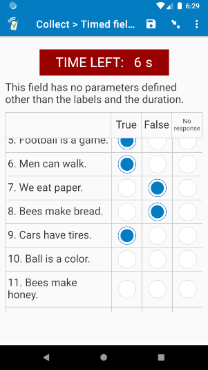
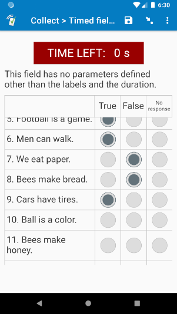
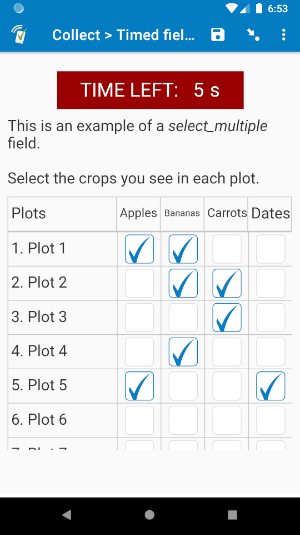
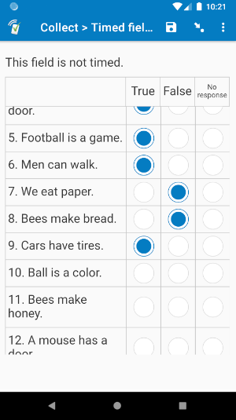
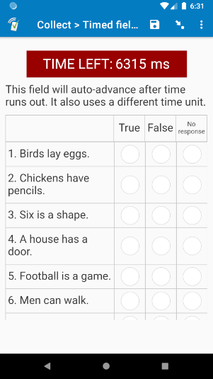
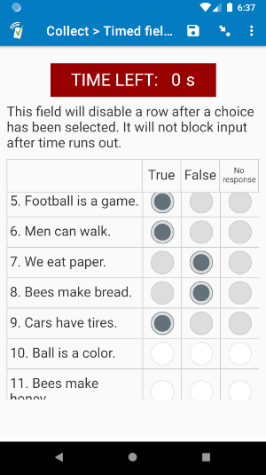
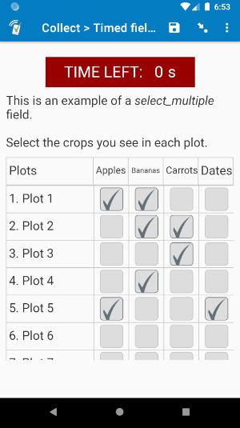
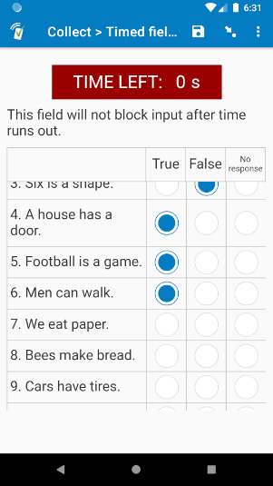

# Timed field list

| None selected | All blocked | select_multiple | Not timed |
| --- | --- | --- | --- |
|  |  |  |  |

| Milliseconds | No change | Blocked checks | No blocking |
| --- | --- | --- | --- |
|  |  |  |  |

## Description

Use this field plug-in when you would like to time multiple *select_one* and/or *select_multiple* fields within the same [field list](https://docs.surveycto.com/02-designing-forms/04-sample-forms/05.field-lists.html). This will have a persistent timer at the top, even if the enumerator/respondent scrolls down. The timer is optional, so you can also use the field plug-in to create a scrollable field list group.

To learn all about how to use this field plug-in, check out the [wiki](timed-field-list/wiki), which goes into full detail on all of the features, parameters, and how to retrieve its data.

For just timing a single *select_one* or *select_multiple* field on a screen, see our [timed-choice](https://github.com/surveycto/timed-choice) field plug-in.

*This plug-in is currently under beta. If you you find a problem with the field plug-in, please email max@surveycto.com.*

### Data format

This field plug-in supports the *select_one* and *select_multiple* field types. Just like with normal fields, the field type will determine what kind of buttons are shown: radio buttons or checkboxes.

Unlike other fields, the choices selected are not stored in the field value, but in the field plug-in metadata. To retrieve that metadata, use the [plug-in-metadata() function](https://docs.surveycto.com/02-designing-forms/01-core-concepts/09.expressions.html#plug-in-metadata). Sections of data are stored in a pipe-separated (`|`) list, with the first section storing time data, and each subsequent section storing the choices selected on each row. To learn how to understand that data, check out the [wiki](timed-field-list/wiki), section *5. Retrieving the selected choices*.

## How to use

### Getting started

**To use this field plug-in as-is**, just download the [timed-field-list.fieldplugin.zip](https://github.com/surveycto/timed-field-list/raw/master/timed-field-list.fieldplugin.zip) file from this repo, and attach it to your form.

**To use with the sample form:**

1. Download the [sample form](https://github.com/surveycto/timed-field-list/raw/master/extras/sample-form/Timed%20field%20list.xlsx) from this repo.
1. Download the [timed-field-list.fieldplugin.zip](https://github.com/surveycto/timed-field-list/raw/master/timed-field-list.fieldplugin.zip) file from this repo.
1. Also download the [button-to-advance.fieldplugin.zip](https://github.com/surveycto/button-to-advance/raw/master/button-to-advance.fieldplugin.zip) field plug-in file ([readme](https://github.com/surveycto/button-to-advance/blob/master/README.md)).
1. Upload the sample form to your server with the two field plug-ins attached.
1. Adjust the parameters as you see fit.

To learn more about using the sample form, check out the [wiki](timed-field-list/wiki), section *1.1 Main sample form*.

### Parameters

There are lots of optional parameters you can use to customize the field plug-in. For details on all of the parameters and how to use them, see the [wiki](timed-field-list/wiki), section *4.1 Required parameter*. However, here is a brief overview of the most common parameters:

|name|Description|Default|
|---|---|---|
|`labels` (required)|List of labels for each row of choices. These will go in the left-most column. Each label should be separated by a pipe (`\|`).|(none)|
|`duration` (optional)|Starting time on the timer. If this parameter is not defined, the field will not be timed.|(none)|
|`header` (optional)|Header of the column with the row labels, i.e. what will be in the top-left cell of the table of choices.|(none)|
|`advance` (optional)|If this field has a value of `1`, then the field will auto-advance when time runs out|`0`|
|`block` (optional)|By default, when time runs out, fields will be blocked, meaning the selected choices cannot be changed (i.e. they cannot be selected or un-selected). If this parameter has a value of `0`, then rows will not be blocked after time runs out.|`1`|
|`nochange` (optional)|If this parameter has a value of `1`, then once a choice is selected in a row, then that row will be blocked, and it cannot be changed.|`0`|

### Default SurveyCTO feature support

| Feature / Property | Support |
| --- | --- |
| Supported field type(s) | `select_one`, `select_multiple`|
| Default values | No |
| Custom constraint message | No |
| Custom required message | No |
| Read only | Yes |
| media:image | Yes |
| media:audio | Yes |
| media:video | Yes |
| `label` appearance | No |
| `list-nolabel` appearance | No |
| `quick` appearance | No |
| `minimal` appearance | No |
| `compact` appearance | No |
| `compact-#` appearance | No |
| `quickcompact` appearance | No |
| `quickcompact-#` appearance | No |
| `likert` appearance | No |
| `likert-min` appearance | No  |
| `likert-mid` appearance | No |

## More resources

* **Sample form**  
You can find a form definition in this repo here: [extras/sample-form](extras/sample-form).

* **Developer documentation**  
More instructions for developing and using field plug-ins can be found here: [https://github.com/surveycto/Field-plug-in-resources](https://github.com/surveycto/Field-plug-in-resources)
